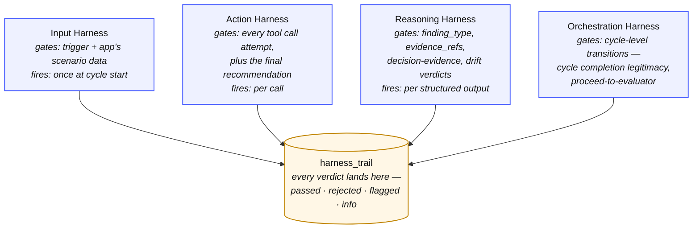
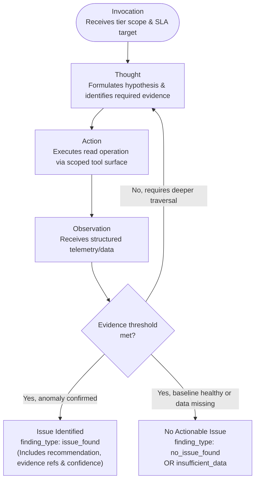
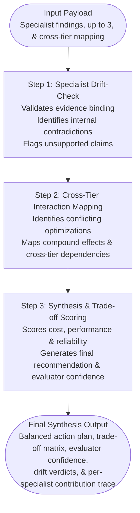

# Architecture

This file is the **how**. The **why** and the system overview live in the [README](README.md) — read that first if you have not. The three constraints the problem imposes (auditability, cross-tier causation, and zero-execution) are what every choice below answers.

This file covers the four cross-cutting concerns the README diagram does not show: design principles, the four harnesses, the specialist ReAct loop, the Cross-Tier Evaluator's three-step synthesis, and which harness applies at which execution stage.

- Per-agent detail lives in [docs/agents.md](docs/agents.md). 
- Per-harness detail lives in [docs/harnesses.md](docs/harnesses.md).

## Design principles

Seven commitments shape every other decision.

1. **Recommender, not executor** The system never changes infrastructure state. Every recommendation routes to a human.
2. **Multi-agent by necessity** Earned, not decorative. Each agent owns a strictly bounded scope to ensure deep analysis. A single agent processing all telemetry at once produces shallow results. Our hierarchical network structurally enforces these narrow boundaries.
3. **Accountability over adversarial defense** Since the system takes no external user input, prompt injection is not a threat. We focus entirely on reasoning quality, consistency, and auditability.
4. **Deliberate synthetic data** Establishing strict ground truth requires hand-crafted scenarios. The dataset is published at [`ameau01/synthesized-cloud-optimization-recommendations`](https://huggingface.co/datasets/ameau01/synthesized-cloud-optimization-recommendations) on Hugging Face.
5. **Harnesses provide properties, not defenses** Harness layers are designed to enforce structure, safety, and observability. They are not a checklist of security defenses mapped against hypothetical threats.
6. **Capability matched to the workload** Each specialist reasons over ~10-15 MCP observations per cycle — nested telemetry distributions, time patterns, per-instance breakouts, configuration metadata. The reference configuration uses a frontier model end-to-end (Opus for specialists and evaluator) because lighter models drop enumeration from long tool outputs and miss the bimodality and cross-tier cues this workload depends on. Models are pluggable via `.env` for cost-sensitive deployments; see [decisions.md](docs/decisions.md) for the trade-off.
7. **Trade-offs are part of the deliverable** Every architectural decision has rejected alternatives. That reasoning is explicitly tracked in [docs/decisions.md](docs/decisions.md).

The deeper rationale for each principle is in [docs/decisions.md](docs/decisions.md) and the sections below.

## The Four Harnesses

The harnesses are not a fifth agent. They are system-wide constraints enforced across the agents themselves and the data they read and produce.

The harnesses are cross-cutting concerns, not a sequential pipeline — each fires at a different kind of event during one cycle. Every verdict (passed, rejected, flagged, info) lands in `harness_trail`, keyed by `check_name` and linked to the audit row it judged via `related_event_id`. The agent's substance — what it decided and what evidence it cited — lives in a separate table, `audit_records`. The two tables together let a reader reconstruct both the decision report (substance) and the enforcement report (verdicts) for any cycle. See `docs/audit-trail.md` for the table-level model and `docs/harnesses.md` for what each harness checks.

## Tier Specialist: the ReAct loop

Each specialist executes a strictly constrained ReAct loop, detailed in [docs/agents.md](docs/agents.md).

**Execution Boundaries:** The ReAct loop, terminal states (`issue_found` / `no_issue_found` / `insufficient_data`), and a worked cycle are detailed in [`docs/agents.md`](docs/agents.md).

## Cross-Tier Evaluator

The Evaluator has three sub-steps in sequence:

**Evaluator Logic:** The three steps run in strict sequence with drift-check first, so a weak or contradictory finding cannot pollute the final synthesis. Full mechanics and correlated-drift handling are in [`docs/agents.md`](docs/agents.md). 

## Where Each Harness Applies

| Execution Stage | Input Harness | Reasoning Harness | Action Harness | Orchestration Harness | Audit Trail |
| --- | --- | --- | --- | --- | --- |
| **Trigger & Ingest** | Validates scenario data: schema, completeness, timestamp continuity | - | - | - | Logs trigger & scenario hash |
| **System Mapper** | Validates Terraform parsing | Verifies the topology conclusion is evidence-backed | Scopes the MCP read surface to scenario-level tools | - | Logs architecture model & analysis plan |
| **Supervisor Decisions** | - | Verifies every routing decision cites the evidence it relied on | - | Validates cycle-level transitions are legitimate (no `completed` without specialists; `failed` carries a `failed_at_stage`) | Logs routing & invocation decisions |
| **Tier Specialist ReAct** | - | Enforces structured reasoning, evidence binding & confidence scoring | Scopes the MCP read surface to the specialist's tier | - | Logs every tool call & reasoning step |
| **Cross-Tier Evaluator** | - | Enforces drift-check, synthesis & trade-off scoring | - | Verifies specialists completed before synthesis runs | Logs drift verdicts, scores & synthesis |
| **Final Recommendation Gate** | - | - | Gates well-formedness, evidence, severity & duplication | - | Logs final gate verdict |
| **HITL Decision** | - | - | - | - | Logs human approval, rejection, or deferral |

The Reasoning Harness carries the heaviest cognitive load. The Action Harness remains intentionally narrow. The Orchestration Harness gates the cycle-level transitions that no single agent owns. The audit trail — split across `audit_records` for agent substance and `harness_trail` for harness verdicts — maintains state across the entire lifecycle. The Input Harness acts strictly as the front door.
